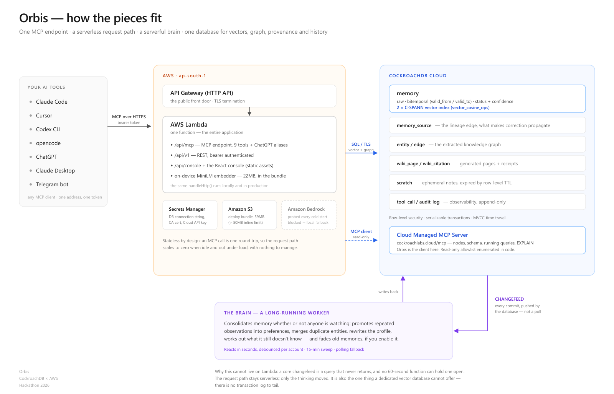

# Orbis

**One memory. Every agent. Yours.**

Connect once. Every AI tool you use — Claude Code, Codex, Cursor, opencode,
Antigravity, ChatGPT — reads and writes the same memory, through a single MCP
endpoint backed by CockroachDB.

**Live demo:** https://afctmu6tki.execute-api.ap-south-1.amazonaws.com
**The story:** [BLOG.md](BLOG.md)


---

## What is this, in sixty seconds

Every AI tool keeps its own memory, and none of them can read the others'.
Tell Claude Code your database schema on Monday, and Cursor has never heard of
it on Tuesday. People solve this today by pasting the same context into four
config files and keeping them in sync by hand — that is exactly what I was
doing, with a sixty-line protocol file, before building this.

Orbis is the shared memory those tools were missing:

- **One address.** `https://your-host/api/mcp`. Every MCP-capable tool
  connects to the same URL with a token. From then on they share one memory.
- **Recall by meaning.** Ask *"how long do people have to get their money
  back"* and find a note that says *"reimbursement within thirty days"* — no
  shared words needed.
- **A brain that tidies up.** A background worker listens to a CockroachDB
  changefeed and reorganises memory as it changes: repeated observations
  become preferences, duplicate entities merge, a profile page rewrites
  itself — whether or not anyone is looking.
- **Correction that propagates.** Mark one memory wrong and Orbis shows
  everything derived from it, however many hops away, before anything changes.
- **It asks.** Orbis works out what it *doesn't* know about you and raises
  questions any connected agent can ask you mid-task.
- **It's yours.** One click exports everything as JSON. Forgetting (memory
  decay) exists but is off unless you turn it on. Nothing is ever silently
  deleted.

## Try the live demo (nothing to install)

Open https://afctmu6tki.execute-api.ap-south-1.amazonaws.com and click around —
it is the real system with real imported data, read-only for visitors:

1. **memories** — search *"how long to get my money back"* and watch it find
   the refunds note. The timing and "ranked by meaning" line are live.
2. **about you** — a profile written by consolidation, every claim cited back
   to the memories it came from.
3. **ask** — open the existing conversation to see the tool trace under a
   reply.
4. **activity** — every tool call ever made against this instance, with
   latency percentiles. The CockroachDB panel runs `EXPLAIN` live and shows
   whether the vector index was chosen.
5. **Export** (top of memories) — take the whole dataset home as JSON.
---

## Run it yourself — the complete guide

This is written so someone who has never seen the project can go from a blank
laptop to a working Orbis in about ten minutes. Commands are for
macOS/Linux/WSL and Windows PowerShell alike unless marked.

### 0. Prerequisites

| You need | Version | Get it from |
|---|---|---|
| Node.js | 22+ | https://nodejs.org (LTS installer) |
| git | any recent | https://git-scm.com/downloads |
| Docker Desktop | any recent | https://www.docker.com/products/docker-desktop — **only for the local database path (1A)**. Skip it if you use the free cloud database (1B). |

Check what you have:

```bash
node --version   # v22.x or newer
git --version
docker --version # only needed for path 1A
```

### 1. Get the code and a database

```bash
git clone https://github.com/harshtripathi272/CockroachDB.git orbis
cd orbis
npm install
```

Then pick **one** of the two database paths:

**Path 1A — local, with Docker (best for playing with it):**

```bash
npm run db:up        # starts a real 3-node CockroachDB cluster in Docker
npm run db:migrate   # creates the schema, vector indexes, RLS policies
```

**Path 1B — CockroachDB Cloud, no Docker (best for keeping it):**

1. Create a free cluster at https://cockroachlabs.cloud (no credit card).
2. Copy `.env.example` to `.env` and fill in `CLOUD_DATABASE_URL` (the
   connection string the Cloud console shows you), `CRDB_SQL_USER`,
   `CRDB_SQL_PASSWORD`, `CRDB_HOST`, and `CRDB_CLUSTER_ID`.
3. Set `ORBIS_TARGET=cloud` in `.env`, then:

```bash
npm run db:migrate
```

### 2. Start it

```bash
npm run api    # API + MCP endpoint + console on http://localhost:8787
```

That's the whole app. Two optional processes make it better:

```bash
npm run dev    # hot-reloading console on :5173 (only if you're editing the UI)
npm run brain  # the background worker — reacts to changefeed events,
               # consolidates memory, fades old memories if enabled
```

Open http://localhost:8787 — the onboarding walkthrough starts on first visit.

> **First run note:** the on-device embedding model (~22MB) downloads on first
> use and is cached in `.models/`. The first search takes a few seconds; every
> one after that is fast.

### 3. Connect your AI tools

In the console: **connect → Create a token**, copy the token, then pick your
tool — the page shows the exact config to paste for Claude Code, Codex,
Cursor, opencode, Antigravity, Claude Desktop, Zed, Cline, ChatGPT and more.
The quickest one:

```bash
claude mcp add --transport http orbis http://localhost:8787/api/mcp --header "Authorization: Bearer orb_live_YOURTOKEN"
```

Then, in that tool, just work. Say something worth remembering ("we decided to
use Postgres wire protocol for this project") and watch it appear in
**memories**. The **connect** page's third card turns green when a client
genuinely handshakes — it is driven by real connections, not checkboxes.

### 4. Bring your existing memory with you

```bash
node scripts/import.ts --vault="path/to/obsidian-vault" --dry-run  # preview
node scripts/import.ts --vault="path/to/obsidian-vault"           # import
node scripts/import.ts --taste                                    # a Command Code taste profile
npm run dream                                                     # consolidate into a profile
```

### 5. Optional keys (everything works without them)

Paste these in **settings** — no restart needed — or set them as environment
variables:

| Key | What it unlocks |
|---|---|
| `ANTHROPIC_API_KEY` or `OPENAI_API_KEY` | The **ask** tab writes real answers instead of quoting matches. Without either, it still searches semantically and cites what it found — and says so. |
| `CRDB_CLOUD_API_KEY` | Orbis connects out to CockroachDB Cloud's managed MCP server, so the chat agent can ask the cluster about itself (nodes, schemas, query plans). Cloud Console → Access Management → Service Accounts → create one, **assign it the Cluster Operator role**, create an API key. The role matters: a key without it authenticates and then can see no clusters — the console diagnoses this exact state. |
| `TELEGRAM_BOT_TOKEN` | `npm run telegram` — capture memories from your phone. Get a token from `@BotFather`, then pair by sending the bot `/start <an Orbis token>`. |

### 6. Deploy your own to AWS (optional)

```powershell
# Windows PowerShell, with AWS CLI configured (aws configure)
powershell -ExecutionPolicy Bypass -File deploy\deploy.ps1
```

The script builds the console, prunes the bundle to fit Lambda (59MB zipped,
on-device model included), uploads via S3, creates/updates the Lambda + API
Gateway, and stores the database credentials in Secrets Manager. It deploys
with `ORBIS_DEMO=1` — anonymous visitors get read-only; writes need a token.

### Troubleshooting

- **`npm run db:up` fails** — Docker Desktop isn't running. Start it and retry.
- **Search finds only exact words** — the model didn't load; check the banner
  on the console and the `embedder` block in `/api/health`.
- **A client won't connect** — the token is truncated in the config block
  unless you just created one. Create a fresh token and paste the full value.
- **`@modelcontextprotocol/server-http-sse` not found** — that package does
  not exist on npm despite circulating in setup guides. The real bridge for
  stdio-only clients (Claude Desktop, Zed) is `mcp-remote`, which the Setup
  page's configs already use.

---

## Architecture



```
   Claude Code ─┐
   Codex ───────┤
   Cursor ──────┼──▶  /api/mcp  ──▶  orbis-core  ──▶  CockroachDB
   opencode ────┤   Streamable HTTP    memory · graph      vector index
   Antigravity ─┤   bearer auth        wiki · context      RLS · MVCC
   ChatGPT ─────┘                                          audit log
                                            ▲                  │
   console (React) ──▶ /api/console         │                  │ CHANGEFEED
   scripts ──────────▶ /api/v1              │                  ▼
   Telegram bot ─────▶ same tool layer      └────────── the brain (worker)
                                                 consolidate · merge · fade
```

**The request path is serverless** (Lambda + API Gateway): an MCP call is a
stateless round trip, and the same `handleHttp` function serves local
development and production. **The thinking is not**: the brain holds a
CockroachDB changefeed open — a query that never returns, which no 60-second
function can hold — and consolidates within seconds of a write landing,
debounced per account. If the changefeed drops it falls back to polling, and a
15-minute sweep bounds staleness either way.

**Four layers, one database.** Raw memories, extracted entities and edges,
generated wiki pages with citations, and a personal profile. Systems in this
space typically compose four datastores to get vector search, graph traversal,
provenance and history. Doing it in one is the entire argument for putting
agent memory in a distributed SQL database rather than beside one.

| Table | Role |
|---|---|
| `memory` | raw, vector-indexed, bitemporal (`valid_from`/`valid_to`) |
| `memory_source` | **the lineage edge** — what makes correction propagation possible |
| `entity` / `edge` | the extracted graph |
| `wiki_page` / `wiki_citation` | generated pages and their receipts |
| `interview_question` | what Orbis knows it does not know |
| `scratch` | ephemeral working notes — expired by CockroachDB **row-level TTL** |
| `tool_call` / `client_connection` | observability, and the Setup page's green light |
| `audit_log` | append-only, written in the same transaction as each change |

### The MCP endpoint

Streamable HTTP, spec `2025-06-18`, with **no SSE at all**. The spec permits
answering POST with `application/json` and GET with `405`, and taking both
options removes streaming entirely. That is honest here — Orbis has no
server-initiated messages — and it keeps the same handler viable behind a
serverless function.

Nine tools, plus `search`/`fetch` aliases in OpenAI's schema so one endpoint
also serves ChatGPT's deep-research path. Governance lives at the protocol
boundary, not in the console: `remember` refuses a memory with no substance,
`search_memory` can never return a retracted memory, `correct` always reports
what it invalidated. Ten agents from four vendors are held to one standard
because the rule is in the endpoint they all share.

### Both directions of the protocol

Orbis is also an MCP **client**: it connects out to CockroachDB Cloud's
managed MCP server (`https://cockroachlabs.cloud/mcp`) with a hand-written
Streamable HTTP client, so the chat agent can ask the cluster about itself in
the same turn it asks memory about you. The tools it will call are an
**enumerated read-only allowlist** in code — not the server's own
`readOnlyHint` — because the Cloud server registers `insert_rows` and
`delete_rows` for accounts with the roles, and a chat agent that can be talked
into `delete_rows` on a production cluster is not a feature.

---

## Hackathon requirement coverage

Stated plainly: what is wired and working, and what is not.

### CockroachDB tools — 3 of 4 (2 required)

| Tool | Status |
|---|---|
| **Distributed Vector Indexing** | ✅ **In use.** Two C-SPANN indexes with `vector_cosine_ops`. The console runs `EXPLAIN` live and labels whether the index was chosen, so index use is falsifiable rather than asserted. |
| **Agent Skills Repo** | ✅ **Installed** — 34 skills via `npx skills add cockroachlabs/cockroachdb-skills`. |
| **Cloud Managed MCP Server** | ✅ **Consumed as a client** — live handshake, tool discovery, read-only allowlist, merged into the chat agent as `crdb_*` tools, surfaced in **activity → Cloud MCP**. |
| ccloud CLI | ❌ Not used. Nothing in Orbis provisions clusters, which is what that CLI is for. |

### AWS services — 4 in use (1 required)

| Service | Status |
|---|---|
| **AWS Lambda** | ✅ Runs the whole application — MCP endpoint, REST API, console. |
| **API Gateway (HTTP API)** | ✅ The public front door. |
| **Secrets Manager** | ✅ Holds the DB connection string, CA cert, and Cloud API key. None are in the function's environment. |
| **S3** | ✅ Deployment artefacts (the bundle exceeds the 50MB inline limit). |
| Bedrock | ⚠️ **Coded, blocked, and no longer needed.** `InvokeModel` returns `ValidationException: Operation not allowed` — a new-account gate. Selection probes it first on every cold start, so if the account is ever unblocked Bedrock applies itself with no redeploy. |

### What is real, and what is not

**Real, and covered by tests against a live cluster:** semantic recall, the
vector indexes and their query plans, correction propagation, bitemporal
history, serializable retry behaviour under 20-way contention, row-level
security, entity extraction, the MCP wire protocol (both sides), the
changefeed-driven brain, consolidation — and all of it running on the deployed
Lambda, not only locally.

**Labelled honestly in the product:**

- **Chat needs a key you supply** — without one it answers from retrieval
  alone, with citations, and a banner says no model wrote the reply.
- **The Telegram bot needs a bot token** — code and tests complete, no hosted
  instance.
- **The public demo is read-only** — every write control explains this rather
  than failing. A bearer token unlocks writes.

**Absent, by design:** no LLM in consolidation or entity extraction — see
below for why. Nothing is simulated.

---

## Things that were measured, not assumed

Full write-ups in [BLOG.md](BLOG.md); the short versions:

**The 22MB on-device model beat the 130MB one.** MiniLM-L6-v2 (q8): 5/5 top-1
on the retrieval benchmark with a 0.166 margin to the runner-up, 0.5s load.
bge-small-en-v1.5: 4/5, 0.094, 9.4s. Higher absolute similarity scores, worse
decisions. Absolute score is cosmetic; the margin is what makes recall
trustworthy.

**Two clauses silently disqualify a CockroachDB vector index.** An innocuous
`AND embedding IS NOT NULL` drops the index entirely, and so does leaving a
nullable prefix column unconstrained. Both return correct-looking rows; only
`EXPLAIN` tells you. There is a test asserting the failure case *still fails*,
so if CockroachDB ever fixes it, the suite says the workaround can go.

**Enabling RLS is not enforcing it.** `root` bypasses policies and the table
owner is exempt without `FORCE ROW LEVEL SECURITY`. The suite proves the
least-privilege `orbis_app` role fails closed: unscoped sees 0 rows,
cross-account writes are refused by `WITH CHECK`.

**An absolute relevance cutoff cannot work; a relative one can.** A nonsense
query's nearest memory can be *closer* than a fair question's. Cutting
relative to the best hit (keep within 0.10) turned 6-result answers into
1-result answers without losing genuine matches, and when even the best match
is weak, the tool says so — a model told its retrieval was weak hedges instead
of confidently paraphrasing noise.

**Contention scales with latency, not just load.** A retry budget tuned
against a 1ms localhost round trip exhausted itself at Cloud's 40ms. The tests
run against both targets because of this.

## Why consolidation has no LLM in it

- **Reproducibility.** Run it twice over unchanged memories and the wiki is
  unchanged. A sampled model would reword your profile every night, and there
  would be no way to tell a real change from drift.
- **Attribution.** Every sentence is assembled from specific memories, so
  every citation is exact. A model asked to summarise *and* cite will
  sometimes attribute a claim to the wrong source — and a wrong citation is
  worse than none, because it launders a hallucination as evidence.
- **Availability.** No credentials, no network, no cost.

An LLM would write nicer prose. It would not make the profile more true. The
one place judgement is genuinely needed — deciding what Orbis does *not* know
about you — uses vector coverage checks whose thresholds were measured
(filtering probes by memory kind took accuracy from 6/9 to 7/9 with zero
false positives).

---

## Tests

```bash
npm test                      # against the local 3-node cluster
ORBIS_TARGET=cloud npm test   # against CockroachDB Cloud
```

56 tests across 13 suites; on Cloud, 53 pass and the 3 RLS tests skip
cleanly (the `orbis_app` role has no password there) rather than pretending
to pass.

They run against a real cluster, never a mock — every property worth testing
here is a property of the database, and a mock would only assert that the code
calls the functions it calls. The suites cover memory semantics, the vector
index plans, RLS enforcement, 20-way write contention, the MCP wire protocol
from both sides, and the Telegram surface.

## Prior art

Recorded because building something already solved would waste everyone's
time. **No code from any of these was used.**

| Project | What it contributed |
|---|---|
| [innernet](https://innernet.live) | The shape of the whole thing: one MCP endpoint, memory that follows you across tools. Orbis is an independent implementation of that idea on CockroachDB. |
| [open-second-brain](https://github.com/itechmeat/open-second-brain) | The "dream pass" — consolidation promoting repeated signals into confirmed preferences. Adopted, reimplemented in SQL. |
| [Command Code](https://commandcode.ai) | Taste profiles: confidence-scored preferences. Orbis imports these. |
| [mem0](https://mem0.ai) | Extraction-first memory. Confirmed storage-and-retrieval is a crowded, solved space. |
| [Zep / Graphiti](https://arxiv.org/abs/2501.13956) | Temporal knowledge graphs — pushed us to treat time as first-class. |

## Licence

Apache-2.0. See [LICENSE](LICENSE).

Dependencies: `pg` (MIT), `@huggingface/transformers` (Apache-2.0), AWS SDK
(Apache-2.0), React (MIT), Vite (MIT) — all permissive and compatible.
